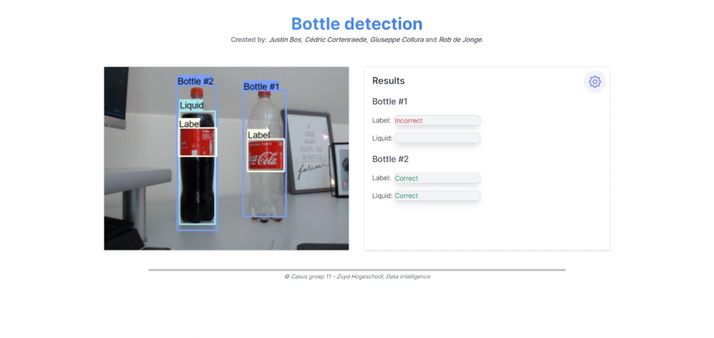
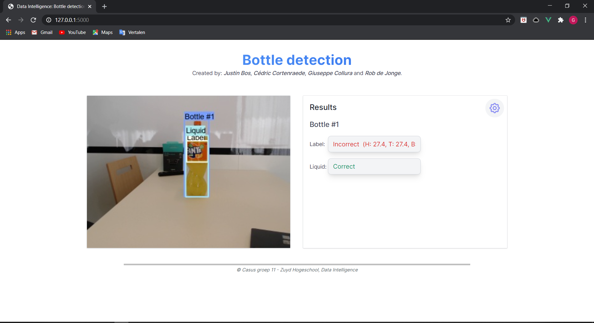

# 1. Bottle detection #
Welkom bij de repository voor bottle detection van casus groep 11.
In deze repository zijn alle onderdelen te vinden die gebruikt worden voor de realisatie van het daadwerkelijke product.

## 1.1 Omschrijving ##
Met behulp van de gecreëerde AI kan de kwaliteitscontrole worden uitgevoerd op een fles.
De AI kijkt of het etiket op de juiste plek zit en of de fles na behoren is gevuld. 
Met behulp van de instellingen zijn de waardes van de AI gemakkelijk aanpasbaar.
Voor het detecteren van de flessen wordt gebruikt gemaakt van object detectie (Tensorflow).

Dit product is een proof of concept voor het lectoraat data intelligence zodat hun kunnen laten zien aan de maakindustrie wat al mogelijk is wanneer je een groep techneuten (ICT'ers) bij elkaar zet.

## 1.2 gedachtegang / ideale situatie ##
Het product kan ingezet worden in een fabriek om aan de lopende band kwaliteit controles uit te voeren.
In deze setting wordt ervan uitgegaan dat er 1 soort fles maar over de band gaat, dus bijvoorbeeld steeds een cola fles van 1.5l of een fata fles van 1l.
Wanneer er gewisseld wordt van soort fles, moeten de instelling in de applicatie aangepast worden (dit kan 'on the fly').
De AI kan op het moment verschillende soorten flessen detecteren, wanneer de gewenste fles niet gedetecteerd kan worden is het mogelijk om deze gekozen fles aan de dataset voor de AI toe te voegen.

## 1.3 Contributers ##
De contributers van het product:

- Justin Bos;
- Rob de Jong;
- Cédric Cortenraede;
- Giuseppe Collura.

## 1.4 Repository structuur ##
Onderstaand worden de hoofd onderdelen van repository structuur weergegeven:

```
Groep11_BD02-3
|   README.md
|   README-BY-JIM.md
|   .gitignore
|
|---docs
|   |   index.html
|   |   <extra pagina's>.html
|
|---objectDetection
|   |---Tensorflow
|   |   |---addons
|   |   |   |...
|   |   |
|   |   |---scripts
|   |   |   |...
|   |   |
|   |   |---workspace
|   |   |   |...
|   |
|   |   INSTALL.md
|   |   Train.ipynb
|
|---web
|   |---static
|   |   |---css
|   |   |   |...
|   |   |---src
|   |   |   |..
|   |
|   |---templates
|   |   |   index.html
|   |   
|   |   app.py
|   |   config.yaml
|   |   tailwind.config.js
|   |   postcss.config.js
```

| File/Folder              | Beschrijving                                                                                                                   |
|--------------------------|--------------------------------------------------------------------------------------------------------------------------------|
| README.md                | Bevat de casus beschrijvingen en informatie/uitleg                                                                             |
| README-BY-JIM.md         | Het voorbeeld bestand voor de README.md                                                                                        |
| .gitignore               | De bestanden die niet worden meegenomen in de versie beheer, deze bestanden worden genegeerd                                   |
| (Folder) docs            | Bevat de documentatie van het project                                                                                          |
| (Folder) objectDetection | Bevat alle onderdelen die gebruikt worden voor de objectdetectie/ detectie van de label en liquid                              |
| (Folder) Tensorflow      | Bestaat uit alle bestanden die gebruikt worden door/voor tensflow                                                              |
| (Folder) addons          | Hierin worden de bestanden gezet die gebruikt worden als extra bij tensorflow, bijvoorbeeld `LabelImg` kan hierin gezet worden |
| (Folder) scripts         | In deze file staan de bestanden die gebruikt worden om de detectie aan te roepen en om de detectie te testen                   |
| (Folder) workspace       | Bevat alle onderdelen van tensorflow (bijvoorbeeld images en model)                                                            |
| install.md               | Hierin wordt de installatie stappen beschreven voor tensorflow en de addons die gebruikt kunnen worden                         |
| (Folder) web             | Bestaat uit alle onderdelen die gebruikt worden voor de web applicatie                                                         |
| (Folder) static          | Bevat de css varianten voor de applicatie                                                                                      |
| (Folder) css             | De standaard css die gebruikt wordt                                                                                            |
| (Folder) src             | De css van [TailwindCss](https://tailwindcss.com/)                                                                             |
| (Folder) templates       | Deze folder bestaat uit de `.html` pagina's die gebruikt worden                                                                |
| __app.py__               | Dit is de _main_ applicatie voor de kwaliteit controle van de fles                                                             | 
| __config.yaml__          | De configuratie file die ingeladen wordt door `app.py`                                                                         |
| tailwind.config.js       | De configuratie file van tailwind                                                                                              |
| postcss.config.js        | De configuratie file van de css                                                                                                |

## 1.5 Installatie ##
Om te zorgen dat de applicatie naar behoren werkt moeten er enkele onderdelen worden geïnstalleerd:

- Installeer tensorflow met behulp van de `install.md` die te vinden is in de repository of via [link](https://github.com/ZuydUniversity/Groep11_BD02-3/blob/development/objectDetection/INSTALL.md).
- Installeer flask met behulp van de [link](https://flask.palletsprojects.com/en/1.1.x/installation/).

## 1.6 Hoe werkt de applicatie ##
Wanneer alle installaties juist zijn voltooid kan `app.py` gerund worden.

De applicatie zal er dan als volgt uitzien wanneer de detectie plaatsvindt op een coca cola fles: 


De applicatie zal er dan als volgt uitzien wanneer de detectie plaatsvindt op een fanta fles:


Aan de linker kant van de applicatie wordt de live feed weergegeven met de detecties. Aan de rechter kant van de applicatie worden de resulataten weergegeven.
Instellingen kunnen aangepast worden door op het tandwiel de drukken.

## 1.7 Fast deployment ##
De 'fast deployment' is ervoor om de applicatie zo snel mogelijk aan de praat te krijgen voor bijvoorbeeld open dagen.

1. Vereist is dat hoofdstuk __'1.5 Installatie"__ voltooid is.
2. Zorg dat het juiste model wordt ingeladen in de `config.yaml` file.
    - kies model 4.0 voor het beste resultaat.
    - De andere modellen worden gebruikt voor testen en zijn gebruikt om verbeter punten te vinden.
3. `app.py` kan gerund worden.
4. Ga naar de instellingen binnen de applicatie voor het label (voor het detecteren van een coca cola fles)
    - The low Hue: 0
    - The high Hue: 255
    - The low Sat: 100
    - The high Sat: 255
    - The low Val: 100
    - The high val: 255
    -  (afhankelijk van de lichtinval moet een beetje verschoven worden met de waardes)
5. Ga naar de instellingen binnen de applicatie voor de vloeistof (voor het detecteren van een coca cola fles)
    - The low Hue: 10
    - The high Hue: 160
    - The low Sat: 0
    - The high Sat: 30
    - The low Val: 200
    - The high val: 255
    -  (afhankelijk van de lichtinval moet een beetje verschoven worden met de waardes)
6. De evaluatie waardes kunnen aangepast worden met behulp van de debug __mode's__
7. Het programma werkt het beste wanneer er een witte achtergrond is achter de fles


---
_Bij vragen neem contact op met casusgroep 11_
