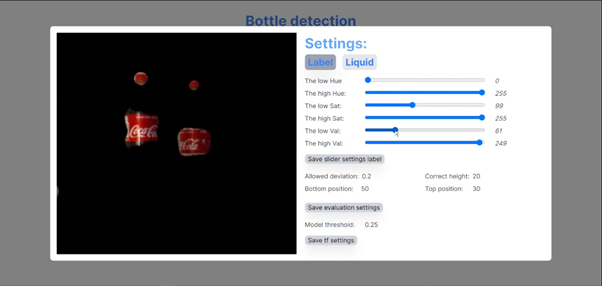

# Overdrachtsdocument #

## VERSIEBEHEER ##

In het versiebeheer wordt bijgehouden wat er is aangepast en/of
toegevoegd en wanneer dat het dan is aangepast en/of toegevoegd.

| Versie nr. | Omschrijving                                         | Datum      |
|------------|------------------------------------------------------|------------|
| 0.1        | De eerste opzet is gemaakt                           | 22-03-2021 |
| 0.2        | De inleiding, opdracht en doelstelling is beschreven | 23-03-2021 |
| 0.3        | Toelichting over de gebruikte methodieken is gemaakt | 24-03-2021 |
| 0.4        | Toelichting over de applicatie is gemaakt            | 25-03-2021 |
| 0.5        | De gedachtegang is gemaakt                           | 26-03-2021 |
| 1.0        | Eerste versie is af                                  | 26-03-2021 |

## Inhoud ##
- [1.0 Inleiding](#1.0 inleiding)
    - [1.1 Aanleiding](#1.1 aanleiding)
    - [1.2 Opdracht](#1.2 opdracht)
    - [1.3 Doelstelling](#1.3 doelstelling)
[2.0 Methodieken](#2.0 methodieken)
- [2.1 Detectie](#2.1 detectie)
    - [2.1.1 Tensorflow](#2.1.1 tensorflow)
    - [2.1.2 Contrastmethodiek](#2.1.2 contrastmethodiek)
- [2.2 Dataset](#2.2 dataset)
- [3.0 Applicatie](#3.0 applicatie)
    - [3.1 Wat is er gemaakt?](#3.1 Wat-is-er-gemaakt?)
    - [3.2 Wat is de gecreëerde omgeving?](#3.2 Wat-is-de-gecreëerde-omgeving?)
- [4.0 Gedachtegang](#4.0 gedachtegang)
    - [4.1 Optimale omgeving](#4.1 Optimale-omgeving)
    - [4.2 Flessen die de AI het beste detecteert](#4.2 Flessen-die-de-AI-het-beste-detecteert)
- [5.0 toekomst / Aanbevelingen](#5.0 Toekomst-/-Aanbevelingen)    

## 1.0 Inleiding ##

In dit document wordt de overdracht besproken van de opgeleverde product
van casus groep 11. De opdracht gaat over de kwaliteitscontrole in de
maak industrie. Bij deze opdracht wordt gekeken naar het vloeistofniveau
in een fles en de positie van het geplakte etiket op de fles. Op basis
hiervan kan er een kwaliteitscontrole plaatsvinden dat laat zien of deze
fles goed is of niet.

In dit document wordt het eindproduct uitgelegd en hoe hier mee gewerkt
kan worden. Daarnaast worden er ook enkele keuzes uitgelegd.

### 1.1 Aanleiding ###

Binnen het lectoraart Data Intelligence van Zuyd Hogeschool willen ze
meer kennis over de mogelijkheden binnen industrie 4.0. Hierbij
willen ze weten wat de mogelijkheden zijn van "slimme machines" die
hetzelfde werk kunnen doen als mensen. Deze kennis zouden ze graag
willen overbrengen naar andere doormiddel van een proof of concept.

### 1.2 Opdracht ###

Industrie 4.0 is de digitale transformatie van de maakindustrie en
aanverwante sectoren. Het draait allemaal om een andere, slimmere
benadering van elke stap in het proces, waaronder
productie, voorraadbeheer in de toeleveringsketen en meer. Een van de
doelstellingen is om 'slimme machines' te maken die in staat zijn om te
zien, te communiceren en hetzelfde werk te doen als mensen, meteen
grotere precisie en betere resultaten. Door machines in staat te stellen
informatie uit de fysieke wereld waar te nemen en met behulp van deze
informatie mensen te helpen bij complexe processen, hierdoor wordt de
deur geopend voor vele mogelijkheden. Veel bedrijven zijn bezig met de
implementatie of overwegen een idee van Computer Vision op hun
productielocaties.

### 1.3 Doelstelling ###

Binnen het project ligt de hoofdfocus op het ontwerpen van een
product dat de elementen van een fles beter kan meten. Hiervoor moet een
demonstrator gemaakt worden die in staat is om aan de hand van live
beelden het vloeistofniveau in een fles en de positie van het geplakte
etiket te controleren. Hierbij moet gebruik gemaakt worden van Computer
Vision.

## 2.0 Methodieken ###
### 2.1 Detectie ####

#### 2.1.1 Tensorflow ####

Tijdens het proces van het creëren van het systeem dat flessen kan
detecteren met hun inhoud en hun etiketten zijn er veel ups en downs
geweest. Een voorbeeld hiervan is dat er veel aanpassingen gemaakt
moesten worden aan de datasets en de methodieken, maar het positieve is
dat het eindproduct nu beter is dan voorafgaand. Om mee te beginnen is
er gekozen voor objecten detectie van Tensorflow. Dit is gedaan door een
eigen dataset te maken en de afbeeldingen in de dataset te labelen.
Vervolgens is dit getraind en is er een model dat gebruikt kan worden.
Met dit gemaakte model worden de flessen gedetecteerd.

#### 2.1.2 Contrastmethodiek ####

Naast het detecteren van de elementen van een fles door middel van
object detection is er ook gekozen voor een contrastmethodiek. De
contrastmethodiek detecteert via maskers op de camera de objecten uit de
afbeeldingen en dus ook uit de live feed haalt met behulp van de
overeenkomende kleuren met de zoekopdracht. De elementen van de fles die
gedetecteerd worden via deze methodiek is het etiket en de vloeistof.

### 2.2 Dataset ###

Aangezien een AI voor de eerste keer trainen niet voor iedereen even
succesvol zal zijn, is er ook in dit project in het trainen van de AI
diverse veranderingen aan de dataset gemaakt. De projectgroep startte
met een dataset van een grote capaciteit. De dataset bevatte daarbij ook
foto's van hoge kwaliteit, wat niet overeenkwam met de camera kwaliteit
van de gebruikte tool "cv2", waardoor de detectie niet geheel
betrouwbaar was en de AI als resultaat veel problemen had met betrekking
tot lichtinval en positie van de fles.

De tweede poging werd er gebruik gemaakt van dezelfde foto's, maar de
dataset werd verkleind. De AI werd hierdoor echter veel slechter,
aangezien deze bijna niets detecteerde.

Nadat deze fout was begaan, werd de dataset verkleind en werd de
kwaliteit van de camera gelijk gemaakt aan die van cv2. Dit zou
betekenen dat de AI getraind werd op dezelfde kwaliteit als de camera
tool, waardoor de AI beter getraind zou worden als voorheen. Dit werd
uiteindelijk een succes, aangezien de AI beter de flessen detecteerde,
de inhoud en het etiket. Dit was dus progressie voor de groep.

Nadat dit is toegepast zijn de studenten begonnen met objecten op de
achtergrond te zetten, waardoor de AI deze niet meer hoorde te
detecteren. Ook na het uitvoeren van deze teststap was dit een succes.

Vervolgens gingen de studenten verder met het uitbreiden van de AI door
middel van een nieuwe dataset, echter dit ging mis aangezien de AI te
veel rekening moest houden met diverse elementen.

Hierna hebben de studenten de beslissing genomen om naar kleurdetectie
te wisselen voor de inhoud van de fles, waardoor alleen de fles nog over
bleef voor de object detection. De AI is daarna opnieuw getraind voor
alleen de flessen te detecteren, waardoor hij tot het laatste model is
gekomen.

## 3.0 Applicatie ##
### 3.1 Wat is er gemaakt? ###

Tijdens de casus van BD02: Artificial Intelligence van Zuyd Hogeschool
in Heerlen hebben diverse groepen een AI en een applicatie gecreëerd
voor het Data Intelligence bureau voor een flessen detectie systeem. Het
flessen detectie systeem zorgt ervoor dat de fles, de inhoud en het
etiket gedetecteerd worden door middel van de methodieken die zijn
beschreven in 2.1: Detectie. Het flessen detectie systeem detecteert
door de hoogte van de fles niet alleen of de fles de juiste hoeveelheid
qua inhoud heeft, maar het detecteert ook of het label op de juiste plek
is en of deze aanwezig is.

### 3.2 Wat is de gecreëerde omgeving? ###

Het doel van dit project was om een demonstrator te ontwikkelen waarmee
er flessen, het label van de fles en de inhoud van de fles mee
gedetecteerd kan worden. Wij hebben het detectiesysteem verwerkt in een
webapplicatie waardoor het er als geheel onder andere beter uit komt te
zien. Als gebruiker zie je op de hoofdpagina/beginpagina van de
webapplicatie 2 verschillende vakken. In het linker vak wordt het beeld
van de ingebouwde camera van de laptop van de gebruiker of van een
externe webcam getoond.

 
Zodra er een of meerdere flessen voor de
webcam komen dan worden deze flessen gedetecteerd. Daarnaast wordt de
inhoud en het label van beide flessen gedetecteerd. De informatie over
beide flessen komt te staan in het rechter vak. Als er een fles wordt
gedetecteerd, dan komt er in het rechter vak informatie te staan over de
fles. Per fles in het beeld van de webcam komen er als het ware 'vakjes'
te staan waarin die aangeeft op de positie van het label correct
geplaatst is en of de fles vol genoeg is, te leeg is of misschien wel te
vol is. Als de webcam geen flessen detecteert dan komt er in het rechter
vak te staan: __#No bottles__

Als er op het tandwieltje in het rechter vak wordt geklikt dan kom je op
een nieuwe pagina terecht waar je de instellingen en de waardes van de
HSV kunt aanpassen voor het detecteren van het label en de inhoud.

De HSV waardes voor het detecteren van het label kunnen op deze pagina
worden aangepast. In het linker vak zie je net zoals op de
hoofdpagina/beginpagina het beeld van de webcam. Zodra er waardes worden
aangepast in het rechter vak dan worden de HSV waardes aangepast wat te
zien is in het linker vak. Om de aanpassingen te bewaren moet er wel op
de knop _Save slider settings label_ geklikt worden. Als dat namelijk
niet gebeurt dan worden de gemaakte aanpassingen niet bewaart.

## 4.0 Gedachtegang ##
### 4.1 Optimale omgeving ###

De omgeving waarin het flessen detectie systeem ingezet dient te worden
is in een productie sector van een bedrijf dat vloeistoffen
produceert. Het wordt aangeraden dat het ontwerp op een vaste plek staat
in een witte omgeving waar deze het beste de flessen detecteert. De
omgeving van het ontwerp zou dan een lopende band moeten zijn, waarbij
flessen langs komen met hun vloeistof en het etiket al inbegrepen,
ongeacht de hoeveelheid vloeistof in deze fles of de positie van het
etiket. Het is de bedoeling dat er constant dezelfde soort fles langskomt op de lopende band, zodat het systeem hier vooraf op ingesteld kan worden.
Nadat dit gecontroleerd is door het systeem zouden de juiste
flessen gesplitst moeten worden met de onjuiste flessen.

### 4.2 Flessen die de AI het beste detecteert ###

Voor het trainen van de AI is er gebruik gemaakt van cola flessen. Zo
hebben wij de AI getraind met een volle cola fles, lege cola fles, label
op de verkeerde plaats, noem maar op. Daarnaast is de AI ook getraind
met andere objecten in de omgeving.

De AI kan ook andere flessen detecteren maar om het vloeistofniveau en
het label te kunnen detecteren is het belangrijk dat er een duidelijk en
goed verschil is te zien in contrasten niveau. Bijvoorbeeld bij een Coca
Cola fles of Fanta lemon fles is het verschil in contrastenniveau
duidelijk en goed te zien. Zo is de kleur van het label rood en is de
kleur van de vloeistof zwart. Bij bijvoorbeeld een normale Fanta fles
zal het al lastiger worden om de vloeistof en label goed te kunnen
detecteren omdat het label en de vloeistof allebei geel zijn van kleur.

De AI is meerdere keren getraind met verschillende hoeveelheden stappen
en foto's. Na het meerdere malen trainen van de AI is er een dataset
gemaakt die het beste werkt voor de AI. De beste dataset voor de AI is
4.0 en de rest van de datasets wordt gebruikt voor te testen. Als er een
nieuwe betere dataset is gemaakt moet dat in config.yaml in de
applicatie aangepast worden. Wanneer er een andere fles gedetecteerd
moet worden, moeten de instelling in de applicatie aangepast worden (dit
kan `on the fly`). De AI kan op het moment verschillende soorten
flessen detecteren, wanneer de gewenste fles niet gedetecteerd kan
worden is het mogelijk om deze gekozen fles aan de dataset voor de AI
toe te voegen.

__Voor toelichting hoe de webapplicatie in elkaar zit en hoe alles
geïnstalleerd moet worden, zie de bijbehorende:__
    
- [Installatie handleiding](https://github.com/ZuydUniversity/Groep11_BD02-3/blob/development/objectDetection/INSTALL.md).
- [README.md](https://github.com/ZuydUniversity/Groep11_BD02-3/blob/master/README.md)

## 5.0 Toekomst / Aanbevelingen ##
Zoals het opgeleverde product er nu voor staat kun je als gebruiker flessen, het geplakte etiket en het vloeistofniveaudetecteren. 
Daarnaast kun je ook de HSV waardes aanpassen op de instellingen pagina. 
Wat betreft de AI die de flessen, labels en het vloeistofniveau detecteert, bevelen de studenten aan om de AI nog beter en verder te blijven trainen. Hierdoor wordt de AI uiteindelijk nog slimmer van en kan hij nog accurater zijn. Daarnaast zou de ’quality of life’ nog verder uitgebreid kunnen worden, zodat gebruiksgemak nog beter wordt.

Daarnaast bevelen wij ook aan om cola flessen te gebruiken om te laten detecteren. 
De AI zou ook andere flessen kunnen detecteren als de specifieke fles wordt toegevoegd in de dataset.
Vervolgens moet deAI wel nog getraind worden met bijbehorende dataset. 
Ook bevelen wij aan om flessen te gebruiken waar een duidelijk verschil zit in contrasten zoals bijvoorbeeld een cola fles waar de kleur van de vloeistof zwart is ende kleur van het label rood is.
